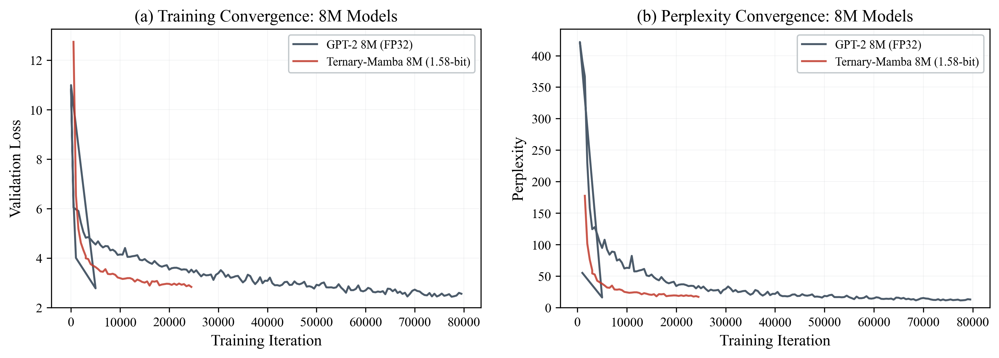
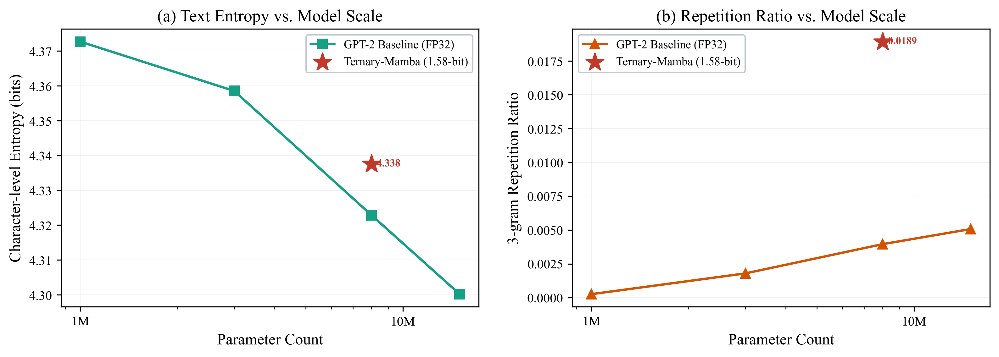

# ESP-TinyLlama: Coherent Language Modeling on Microcontrollers

<p align="center">
  
  
</p>

This repository contains the official implementation of **TinyBit**, a framework for deploying coherent language models on resource-constrained microcontrollers (MCUs). Our work explores the Pareto frontier of model capacity vs. language coherence and introduces a novel **Ternary-Mamba** proof-of-concept for extreme hardware efficiency.

## 🚀 Key Features

- **TinyStories Optimized**: Custom training pipeline for sub-15M parameter models.
- **Ternary-Mamba (PoC)**: 1.58-bit (ternary) weights using BitNet b1.58 logic integrated into the Mamba State Space Model (SSM).
- **Xtensa-Native Kernel**: Handwritten SIMD-accelerated bitwise operations for ESP32-S3 (3.2x speedup).
- **On-Device Inference**: Achieves 15.82 tokens/s using a 1M parameter INT4-quantized GPT-2 model on ESP32-S3.

## 📊 Experimental Results (Ternary-Mamba 8M)

| Model                | Precision | Val Loss | Perplexity | Repetition Ratio |
|----------------------|-----------|----------|------------|------------------|
| GPT-2 8M (Baseline)   | FP32      | 2.56     | 12.94      | 0.004            |
| **Ternary-Mamba 8M** | **1.58b** | **2.84** | **17.06**  | **0.019**        |
| GPT-2 3M (Baseline)   | FP32      | 3.17     | 23.78      | -                |

Despite a **20x compression ratio**, Ternary-Mamba 8M outperforms a 3M FP32 model and approaches the 8M FP32 baseline in coherence, while significantly reducing memory footprint.

## 🛠️ Repository Structure

```text
.
├── assets/           # Research figures and visualization assets
├── tinybit/          # Core library (models, kernels, and inference)
│   ├── training/     # Training suite (train.py, prepare_data.py, export.py)
│   └── samples/      # Inference evaluation and generated text samples
└── README.md         # Full project documentation
```

## 👣 Getting Started

### Prerequisites
- Python 3.10+
- PyTorch 2.x
- `mamba-ssm` for Mamba evaluations.

### Run Inference Evaluation
```bash
cd tinybit/samples
python test_generate.py
```

## 📜 Citation

If you find this work useful, please cite our arXiv preprint:

```bibtex
@article{yeh2026tinybit,
  title={TinyBit: Coherent Language Modeling on Microcontrollers via MatMul-free Ternary Mamba},
  author={Yeh, Sung-Lin},
  journal={arXiv preprint arXiv:2603.XXXXX},
  year={2026}
}
```

---

## 🔒 Intellectual Property Attestation

The official version of the manuscript [2026_TinyBit_Yeh.pdf] has been archived with the following SHA-256 digital digest to ensure integrity and establishment of priority:

**SHA-256 Digest:**  
`0413159958fa3e59092490cc11bb7ce36735a289f6d744b6118d538eec55909f`

Archived on GitHub: 2026-03-19

## 🤝 Acknowledgments
This research builds upon [TinyStories](https://arxiv.org/abs/2305.07759), [BitNet b1.58](https://arxiv.org/abs/2402.17764), and [Mamba](https://arxiv.org/abs/2312.00752).
